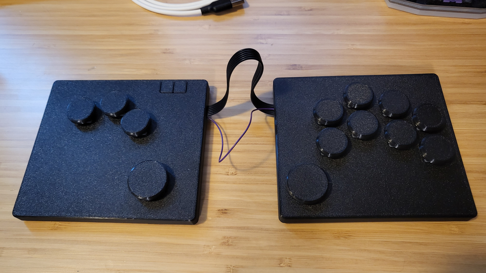

# Splatbox Fightstick

A prototype for a split ergonomic fightstick inspired by [Flatbox](https://github.com/jfedor2/flatbox). This is a project to learn Autodesk Fusion and ki-cad. With the goal of making a more comfortable and ergonomic DIY fightstick option for myself and anyone else that might be interested.

## BOM (as shown)
- Waveshare rp2040 zero
- 13 x choc switches (pictured are [lowprokbs twilight](https://lowprokb.ca/collections/switches/products/ambients-silent-choc-switches?variant=44873426436260) switches)
- 2 x tact switches (Start and Select buttons)
- 8 x m3 6mm screws
- 8 x m3 heat-set inserts
- wire
- 3d printed case (STL and STEP available)
- rubber feet

## Building
 
This is very much a PoC and the build was quick and dirty but here is a rundown of the steps. 
- flash rp2040 ([firmware](https://gp2040-ce.info/downloads))
- print case (I used petg, it has a little to much flex imo)
- set m3 inserts
- glue tact switches to the tact switch holder
- glue tact bench to case
- insert switches into case
- wire everything up to the rp2040 ([wiring guide](https://gp2040-ce.info/controller-build/wiring/#waveshare-rp2040-zero))
- screw on bottom of case

## TODO:
- [ ] PCB design
- [ ] Case re-design to accommodate the PCB
- [ ] More modularity (some way to extend or shorten the cable)
- [ ] Wireless version (dongle approach using 3 xiao seeeds maybe?)