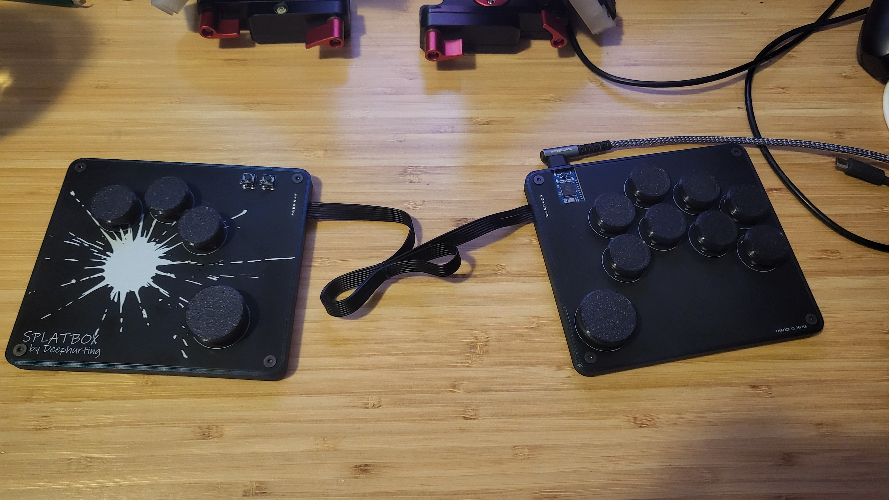
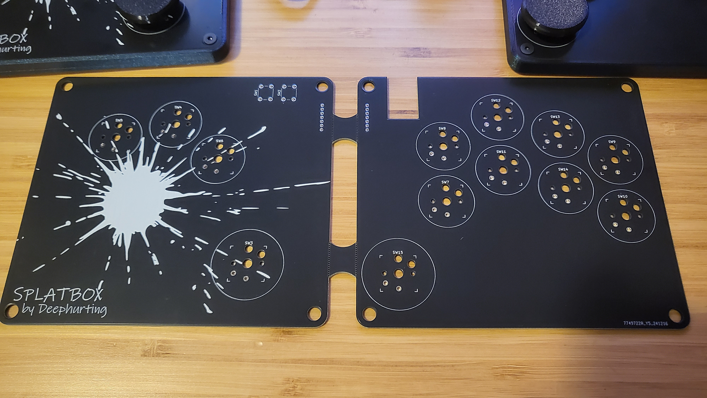

# Splatbox Fightstick

A prototype for a split ergonomic fightstick inspired by [Flatbox](https://github.com/jfedor2/flatbox). Designed to provide a more ergonomic and comfortable DIY option for anyone that might be interested in such a thing. This project also serves as an opportunity for me to do some handwiring and learn Autodesk Fusion and KiCad.

## BOM

- PCB
- Waveshare rp2040 zero
- 13 x choc switches (pictured are [LowProKBs Twilight switches](https://lowprokb.ca/collections/switches/products/ambients-silent-choc-switches?variant=44873426436260))
- 2 x tact switches (Start and Select buttons)
- 8 x M3 6mm screws
- 8 x M3 heat-set inserts
- 28 awg ribbon cable (at least 7 pin)
- 3D printed case (minimal)
- 11 x Small 3D printed [button caps](https://github.com/jfedor2/flatbox/tree/master/3d-printed-buttoncaps)
- 2 x Big 3D printed [button caps](https://github.com/jfedor2/flatbox/tree/master/3d-printed-buttoncaps)
- Rubber feet

## Building

While still far from a finished product, the pcb certainly adds to the stability and reliability of the build.

- Set heat-set inserts in case
- Solder rp2040 zero
- Solder switches
- Solder ribbon cable to one side or the other
- Feed cable through the holes and solder the remaining side
- Screw the pcb to the case

## TODO:

- [x] PCB design: Create a custom PCB to improve durability and simplify the design
- [x] Case re-design to accommodate the PCB layout
  - [ ] More case options
- [ ] More modularity: Implement a way to extend or shorten the cable
- [ ] Wireless version (dongle approach): Explore a wireless setup using XIAO Seeeds
