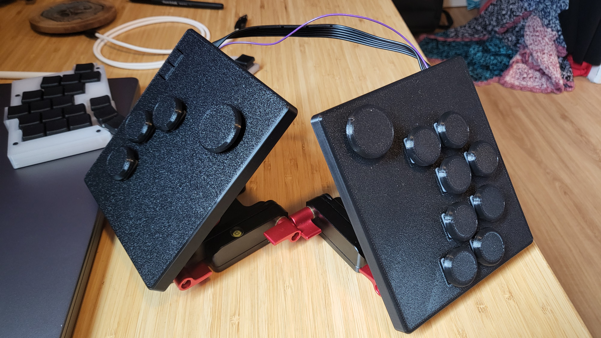

# Splatbox Fightstick

An early prototype for a split ergonomic fightstick inspired by [Flatbox](https://github.com/jfedor2/flatbox). Designed to provide a more ergonomic and comfortable DIY option for anyone that might be interested in such a thing. This project also serves as an opportunity for me to learn Autodesk Fusion and KiCad.

## BOM (as shown)

- Waveshare rp2040 zero
- 13 x choc switches (pictured are [LowProKBs Twilight switches](https://lowprokb.ca/collections/switches/products/ambients-silent-choc-switches?variant=44873426436260))
- 2 x tact switches (Start and Select buttons)
- 8 x M3 6mm screws
- 8 x M3 heat-set inserts
- Wire
- 3D printed case
- 11 x Small 3D printed [button caps](https://github.com/jfedor2/flatbox/tree/master/3d-printed-buttoncaps)
- 2 x Big 3D printed [button caps](https://github.com/jfedor2/flatbox/tree/master/3d-printed-buttoncaps)
- Rubber feet

## Building

This is very much a Proof of Concept, and the build was quick and dirty. But, if you want to make one here's a rundown of the steps:

- Flash the RP2040 ([GP2040-CE firmware](https://gp2040-ce.info/downloads/))
- 3D print the case (I used PETG, but it has a bit too much flex; consider using a more rigid filament)
- Set the M3 heat-set inserts
- Glue the tact switches to the tact switch holder (3D-printed)
- Glue the tact switch holder to the case
- Insert choc switches into the case
- Wire everything up to the RP2040 ([wiring guide](https://gp2040-ce.info/controller-build/wiring/#waveshare-rp2040-zero))
- Assemble the case by screwing on the bottom with 8 x M3 screws
- Glue as needed
